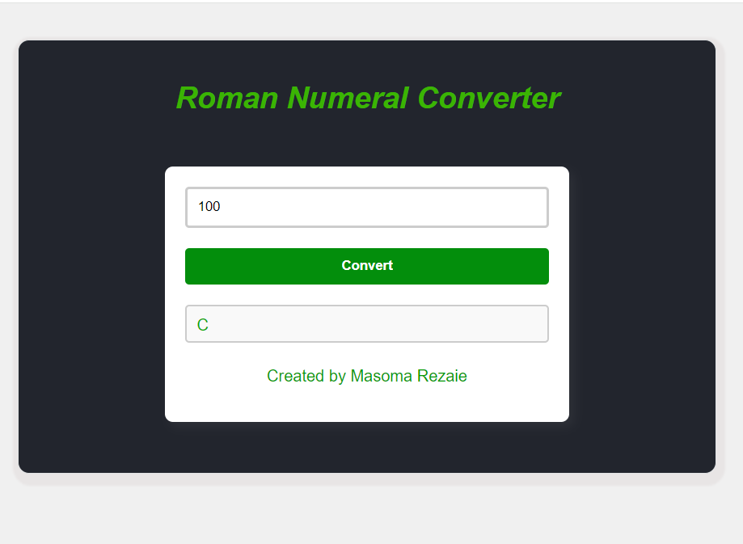

  # Build-a-Roman-Numeral Checker🚀
>This repository contains a-PRoman Numeral Checker that means Roman numerals are based on seven symbols and can be written using various combinations to represent Arabic numeralsa. This documentation serves as a guide for developers, contributors, and users to understand the architecture, implementation details, and usage instructions for the project. This project is built by html, css and Javascript. Trough creating this repository, users will learn the html,css and Javascript that how style and get functions to a webpage.

**How to use this project?**
To use this project, follow these steps.
Enter  a number .
Click on the "covert" button, user will get the nemeral letter of the number.

**This project is created:**
HTML
CSS
Javascript

**To create a Palindrome Checker:**
create a hmlh file.
create a css file.
create a Javascript file.
link correctly the css and js file in html. (<link<link rel="stylesheet" href="./styles.css"> or 
</head>>)

## Demo 📸

## Technologies Used 🛠️
This project is built by:
- HTML
- CSS
-Javascript

## Installation 💻
first install git and create a github account.
Create a repositpry for this project.
clone the project in local machine.
use git comments like git add. git comment, and git push.
git add: it can add our project{git add (your file name)}
git commeit: it can commit the changes.
git push: it push the changes into github.

## Usage 🎯

To use this project, follow these instructions:
1. First,  create a repositort 
clone the repository and navigate to the project directory:
open git bush and use git clone: 
git clone https://github.com/yourusername/project-name.git
   cd project-name.
2. Installation: Install the required dependencies using git:
git install
3. Configuration: Configure [Project Name] by editing the config.git file.

## Author 👩‍💻

Masoma Rezaie.

- Website: [your-website.com](https://github.com/MasomRezaie/Personal-Portfolio-Page/tree/personal-portfolio-page)
- LinkedIn: [Miss Masoma](https://www.linkedin.com/in/miss-masoma-99b85522a?utm_source=share&utm_campaign=share_via&utm_content=profile&utm_medium=android_app)
- Email: [Masoma Rezaie](masom.rezaie135@gmail.com)

## Contributing 🤝

Those who want to contribute in this project with me, can reach out me through:
email:masom.rezaie135@gmail.com
